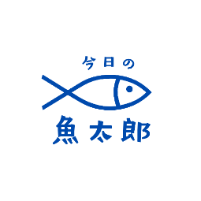
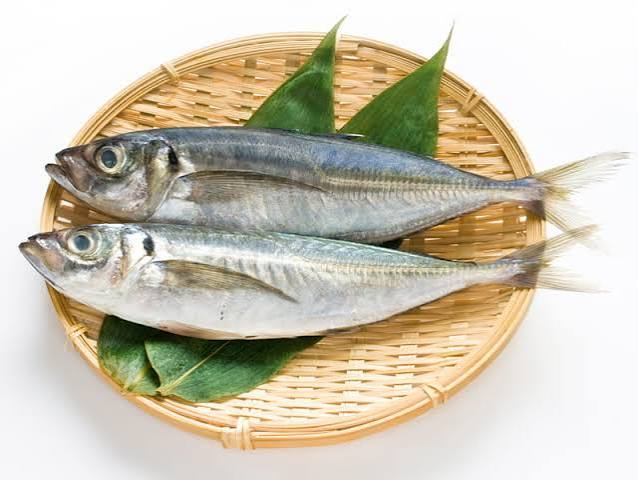
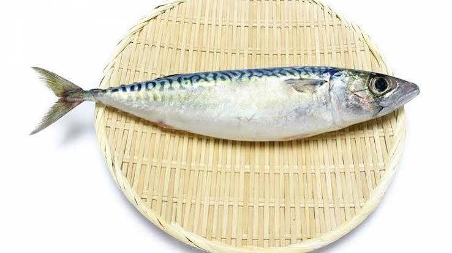
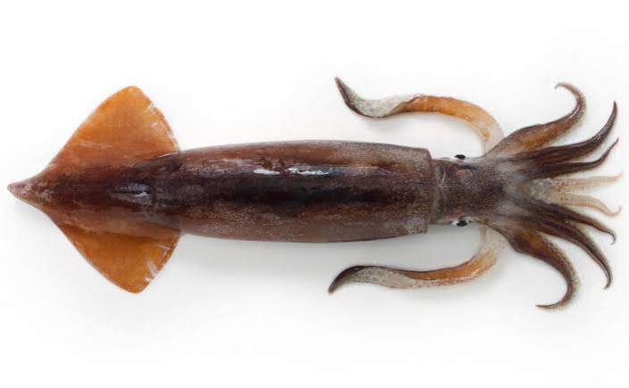

# 今日の魚太郎



商店街の鮮魚店が持つ「目利き・下処理・調理の知識」を、忙しい世代にも届く形に翻訳するサービスのデモアプリです。大学院「新規事業提案」授業の最終発表用に作成しました。

## 背景

- 日本の魚介類消費量は2001年度の40.2kgから2023年度21.4kgへほぼ半減している
- スーパーの一括仕入れにより「町の魚屋」が減り、旬・産地・調理法を教える人がいなくなった結果、消費者が「調理法を知らない」状態になっている
- ペルソナ：商店街の鮮魚店「魚太郎」3代目店主（50代半ば）。20代の4代目が継ぐか未定で、若年層・働き世代の来店が減っている

「今日の魚太郎」は、店主が入荷した魚を登録すると品書き文・調理提案・下処理オプションがAIで下書きされ、店主がそれを自分の言葉に仕上げて公開する。客はその日の魚をスマホ感覚で確認し、値下げのタイミングを見ながら取り置きできる。店じまいの際には、店頭売りと取り置きの売上を登録して、その日の粗利まで確認できる、という体験を1画面のデモで示します。

## 使い方

`index.html` をブラウザでダブルクリックして開くだけで動作します。ビルドやサーバー、npm installは不要です。オフラインでも全機能が動作します。

画面上部のタブで「店主モード」「客モード」を切り替えます。店主モードは「入荷登録」「予約一覧」「売上登録」の3タブ構成です。

### デモ用の写真（demo_pic/）

入荷登録の写真アップロードを実演するための魚の写真を `demo_pic/` に用意しています。

| ファイル | 判定される魚種 |
|---|---|
| `demo_pic/Aji.jpg` | アジ |
| `demo_pic/Saba.jpg` | サバ |
| `demo_pic/Surumeika.jpg` | スルメイカ |

<p>
  
  
  
</p>

これらをエクスプローラー／Finderから入荷登録のドロップゾーンにドラッグ＆ドロップすると、写真がその場でプレビューされ、約0.6秒の「判定中…」演出のあとに魚種が自動で選択されます。

**判定はダミーです。** 画像認識は行わず、ファイル名に含まれる魚種名（`aji`／`アジ`／`鯵` など、ローマ字・かな・カナ・漢字に対応）で魚種を決めています。`surumeika` が `aji` より優先されるよう、長い綴りから順に照合します。魚種名が見つからないファイル名の場合はアジと判定します。この挙動を利用して、`Kamasu.jpg` `Isaki.jpg` のように任意の写真をリネームすれば、カマス・イサキのデモにも使えます。

読み込んだ画像はブラウザ内でdata URLとして保持するだけで、どこにも送信されません。

### 店主モード

1. **入荷登録**：写真をドラッグ＆ドロップ（またはクリックで選択）すると、その場でプレビューされ、公開後は客モードのカード写真として使われます。魚種を選び、数量・仕入れ値・希望売価を入力して「品書きを作る」を押すと、店主の一言・調理提案3案・下処理オプションが生成されます。生成結果はすべて店主が編集でき、編集すると「魚太郎AIが下書きしました」の表示が「魚太郎さんが手を入れました」に切り替わります。値付けの方法（後述）を設定し、「公開する」で客モードに反映します。設定を変えるたびに、その日の価格がどう動くかがグラフで確認できます。パネル下部の「魚種ごとの入荷登録数量」に、公開した数量が魚種別に積み上がります。
2. **予約一覧**：客からの取り置きが受け取り時刻順に並びます。お客様名・魚種・確保した単価・数量・下処理・予約番号が1行で並び、下処理指示は色付きバッジで目立たせています。「準備完了」で対応済みにできます。未確認の予約はタブにバッジで件数表示されます。
3. **売上登録**：その日の売上を登録し、魚種ごとの成績を確認するタブです（後述）。

### 客モード

本日の入荷が**魚種ごとに1枚のカード**にまとまって並びます。カードには写真（同じ魚種で複数回入荷したときは、写真の付いた最新の入荷分を代表写真として使用）・店主の一言・合計残り数量・価格帯（同じ魚種で価格が異なる場合は「¥380〜¥480」のように幅で表示）が出ます。調理提案はタップで展開します。

カードの中は**価格帯ごとのボックス**に分かれ、それぞれに現在価格・割引率・残り数量・次の値下げまでのカウントダウンが並びます。ダイナミック方式で公開した価格帯には、値動きの理由バッジ（「残りわずかのため据え置き中」「売れ行きに合わせて値下げ中」など）と、その日の値動きを示すミニグラフが付きます。

各ボックスで下処理をラジオボタンで選び、数量をプルダウンで選ぶと（初期値は0尾）、その場に小計（単価 × 数量）が表示されます。**複数の魚種・複数の価格帯をまとめて選べます。** 画面下部の固定バーに選択中の合計尾数と合計金額が集計され、受け取り希望時間を選んで「取り置きする」を押すと、明細付きの確認モーダル（魚種・下処理・単価×数量・合計金額と、この価格で確保される旨）を経て予約が完了します。完了画面には予約番号と明細が表示されます。

画面上部の固定バーには「本日の廃棄予定」がリアルタイムに表示され、予約が入るたびに減少します。

### 売上登録（店主モード）

タブ上部の**売上状況**の表に、魚種ごとの「入荷登録数量／売上数量／売上高／仕入価格合計／粗利」と、その合計行が表示されます。仕入価格合計は入荷登録時の「仕入れ値 × 数量」の合計、粗利は「売上高 − 仕入価格合計」で、プラスとマイナスで色分けされます。

その下に、売上を登録するカードが2種類並びます。

- **店頭分**（公開中の入荷ごと）：仕入れ値・希望売価・**現在売価単価**・残り数量が並びます。売れた数量を入力して「売上を登録する」を押すと、その時点の現在価格で売上高に計上され、残り数量が減ります。時刻スライダーを動かしてから登録すれば、値下げ後の単価で計上されます。
- **取り置き分**（予約ごと）：お客様名と予約番号が付いたカードです。**予約時に確保した価格で固定**され、時間値下げの対象外です。初期値は予約数量が入っているので、そのまま登録すれば受け渡し済みとして計上できます。

残り数量を超える数量を入力するとトーストで警告し、登録は行われません。

### 現在時刻スライダー

ヘッダーの時刻スライダー（15:00〜20:00）を動かすと、全カードの価格とカウントダウン、売上登録の現在売価単価が連動して変化します。デモで値下がりの様子を見せるための操作です。

## 値付けの二方式

店主は商品ごとに値付けの方法を選べます。

### 時間で値下げ（デフォルト）

従来どおりの固定スケジュールです。定価 → 値引き開始 → 閉店直前セール の3段階で、設定した割引率まで階段状に下がります。**値引き開始時刻・閉店直前セール開始時刻と、それぞれの割引率は商品ごとに自由に設定できます**（初期値は18:00から20%引き、19:00から40%引き）。設定した時刻は各段階の見出しに即座に反映され、価格グラフも連動します。

### 売れ行きに合わせる（ダイナミックプライシング）

時間だけでなく**在庫の減り方**にも連動して、価格が連続的に変わります。考え方は店主の判断そのままで、「閉店に向けて少しずつ下げる」ことを基本にしつつ、

- 想定より**売れていなければ**、値下げを早める
- 想定より**売れていれば**、値下げを控える（残りわずかなら据え置き）

という補正を掛けます。「想定」は、閉店までに在庫が一定ペースで捌けていく線を基準にしています。

店主が調整できるのは次の3つです。

| 設定 | 意味 |
|---|---|
| 閉店時の最大値引き | 20:00時点で最大どこまで下げるか |
| 売れ行きへの反応 | 上記の補正をどれだけ強く掛けるか |
| 最低利益率 | 仕入れ値に対する下限。**これを下回る価格にはなりません** |

価格は10円単位に丸められます。値下げが原価を割ることはなく、公開前のグラフに仕入れ値と下限価格が破線で表示されるので、店主は「どこまで下がるか」を確認してから公開できます。

取り置きが成立した時点の価格は予約に固定されます。その後に価格が下がっても、売れ行きによって上がっても、予約済みの金額は変わりません。売上登録でも、取り置き分はこの固定価格で計上されます。

## AI生成の扱い

品書き文・調理提案・下処理オプションは、あらかじめ用意した5魚種（アジ・サバ・カマス・イサキ・スルメイカ）ぶんのJSON定数から、約0.8秒のローディング演出を挟んで返します。写真からの魚種判定もファイル名によるダミーです。外部APIは呼び出さないため、ネットワークなしで完全に動作します。

## 技術要件

- 単一HTMLファイル（`index.html`）にCSS・JSを内包。外部CDNは使用していません
- ロゴはbase64のdata URIとして`index.html`に埋め込んでいるため、`uotaro_logo.png`が無くても表示されます（`uotaro_logo.png`は元データ）
- アップロードした写真はブラウザ内でdata URLとして保持し、外部には送信しません
- データは`localStorage`ではなくJS変数に保持し、リロードで初期化されます
- グラフ・値動きのミニグラフはインラインSVGを手書きしています（チャートライブラリ不使用）
- スマホ幅（375px）・PC幅の両方でレイアウトが崩れないよう実装
- 数量0や魚種未選択などの不正入力に対してクラッシュせず、インライン表示またはトーストでエラーを返します

## ディレクトリ構成

```
uotarou-demo/
├── index.html          # アプリ本体（このファイルを開くだけで動く）
├── uotaro_logo.png     # ロゴ画像（本体にはbase64で埋め込み済み）
├── demo_pic/           # デモ用の魚の写真（ドラッグ＆ドロップ実演用）
│   ├── Aji.jpg
│   ├── Saba.jpg
│   └── Surumeika.jpg
└── README.md
```

## デザイン

藍色と白を基調に、商店街の魚屋らしい温かみと、若い世代が使う前提の見やすさを両立させています。絵文字は使用していません。
